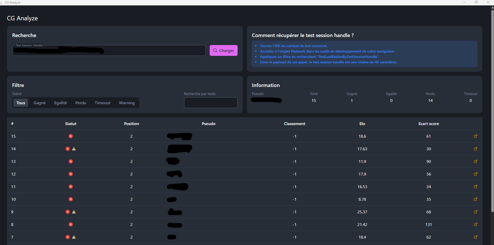

# CG Analyze

Projet d'analyse des matchs codingame

Il permet d’identifier facilement les matchs perdus, notamment en cas de timeouts, tout en affichant des messages
d’avertissement. Il recherche également directement dans vos sorties standard (stdout) ou d’erreur (stderr) pour
détecter les messages spécifiques que vous auriez pu écrire dans certaines situations

## Technos

- Framework: Tauri, Angular,
- Language: Rust, Typescript, SCSS, HTML

## Local dev

Nécessaire: Node.js, npm, rust, cargo

Installer les dépendances: `npm install`

Lancer l'application complète: `npm run tauri dev`
Lancer uniquement l'ihm angular: `npm start`

## Build l'application

`npm run tauri build`

## TODO

- Une grosse relecture du code Rust, il y a surement moyen faire tout ça plus propre et surtout plus robuste (entre les
  clone(), les unwrap() d'Option sans vérifier s'il existe une valeur etc)
- Faire une sauvegarde avec un libelle d'un session handle dans un fichier externe, permet d'éviter de recherche son id
  session à chaque fois